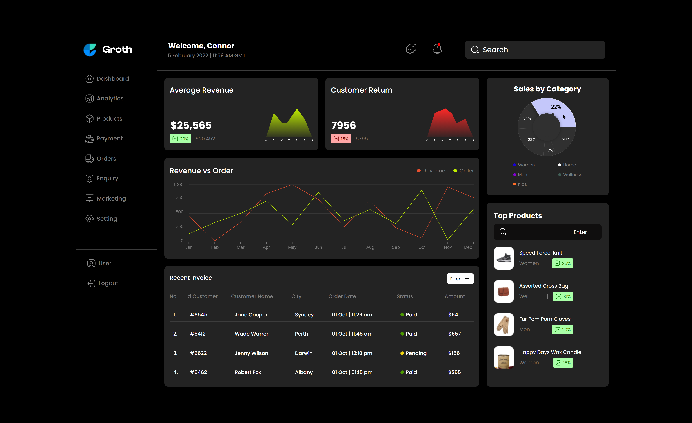
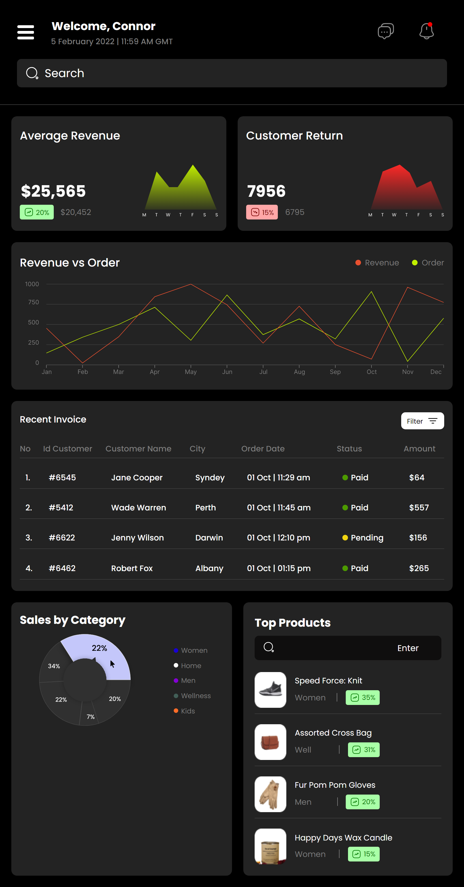
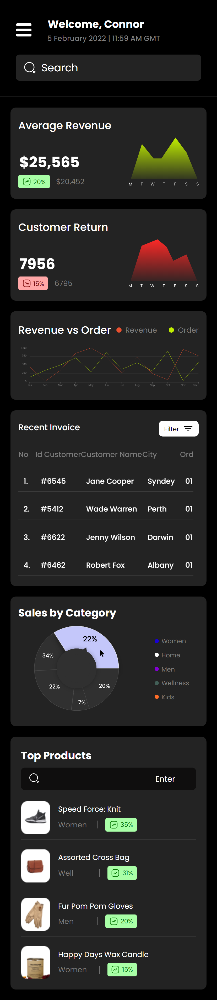

# E-Commerce Dashboard

## Link

https://connor-kfitz.github.io/e-commerce-dashboard/

## Description
The goal of this project was to create a responsive e-commerce dashboard, based off of the Figma page linked below:

https://www.figma.com/community/file/1169921110540120289

## Outcomes

This project was an overall success, the page mimics the mock and is repsonive across various viewports.  The SASS was written well and follows a simple architecture.  I was able to utilize a mixin for the responsive breakpoints.

Going forward there are a few areas I can improve on.  Seperating the SASS components and layouts appropriately, as there are a few mixed up.  Identifying reusable components before writing any code, so that there is no SASS repeat.  Using variables more often, this will help future developemnt and makes changing values significantly easier.

For most projects going forward I will be using React.  Will improve my skills using the framework, and help with seperating components.  I also really dislike writing out list elements in HTML over and over again...

## Pictures

### Desktop

### Tablet

### Mobile
